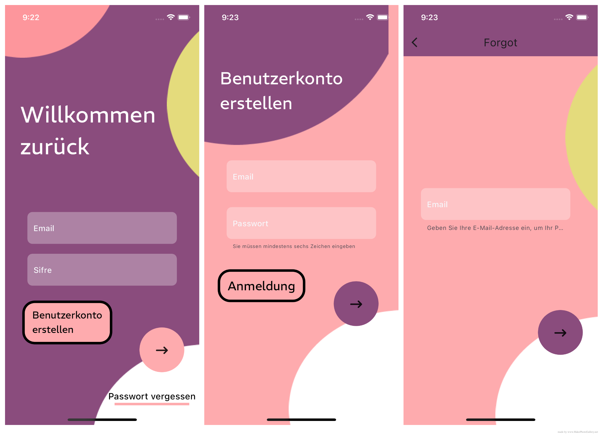
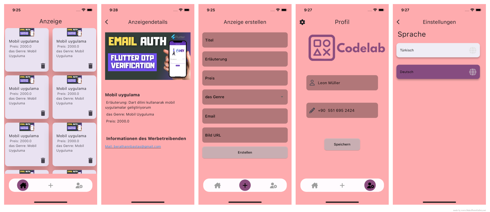

# CodeLab

The service application I developed for freelance software developers can create advertisements for themselves and be found by customers.

## ScreenShots
 

Screens of the application

## Run The Application

- Flutter pub get.
- Flutter run.

## Getting Started

A Flutter starter ecommerce app built with BLOC pattern. It has following features

- Different animations across different part of screen.
- Runs on both Android & IOS.
- It helps in managing state and make access to data from a central place in your project.
- Its a state management system for Flutter recommended by Google developers.

### Dependencies

This project is built with various awesome open sourced libraries

* [flutter_bloc](https://pub.dev/packages/flutter_bloc) - to mantain state and make every widget 
independent using blocs.

* [flutter_localization](https://pub.dev/packages/flutter_localization) - Good for language switching.

